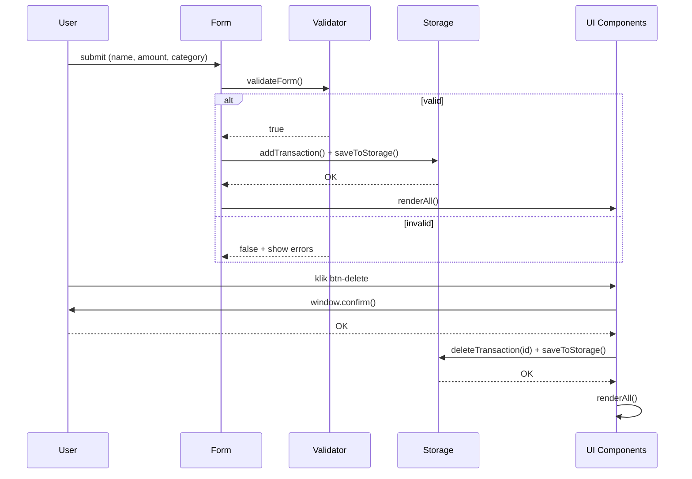

# Design Document

## Expense & Budget Visualizer

---

## Overview

Expense & Budget Visualizer adalah single-page web application (SPA) yang berjalan sepenuhnya di sisi klien. Tidak ada server, tidak ada build step — cukup buka `index.html` di browser. Aplikasi memungkinkan pengguna mencatat pengeluaran harian per kategori, melihat daftar riwayat, meringkas total, dan memvisualisasikan distribusi melalui doughnut chart.

**Karakteristik utama:**
- Pure frontend: HTML + CSS + Vanilla JavaScript (ES6+, `'use strict'`)
- Persistensi via `localStorage` (key: `ebv_transactions`)
- Visualisasi via Chart.js 4.x (CDN, tidak di-bundle)
- Tiga kategori tetap: `Food`, `Transport`, `Fun`
- Tidak ada routing, tidak ada framework, tidak ada npm

---

## Architecture

Aplikasi menggunakan arsitektur **Event-Driven MVC tanpa framework** di dalam satu file JavaScript. Tidak ada state management library — state tunggal (`transactions[]`) disimpan di memori modul, disinkronisasi ke `localStorage`, dan dirender ulang sepenuhnya setiap kali state berubah.

```mermaid
graph TD
    User([Pengguna]) -->|submit form| Form
    User -->|klik hapus| TransactionList

    Form -->|data mentah| Validator
    Validator -->|valid| Storage
    Validator -->|error| Form

    Storage -->|baca/tulis| LS[(localStorage\nebv_transactions)]
    Storage -->|update state| AppState[State: transactions\[\]]

    AppState -->|renderAll()| TransactionList
    AppState -->|renderAll()| SummaryBar
    AppState -->|renderAll()| Chart

    TransactionList -->|delete event| Storage
```

**Alur data "Tambah Transaksi":**
1. Pengguna mengisi form dan menekan tombol submit
2. `validateForm()` memeriksa semua field; jika gagal, tampilkan error dan hentikan
3. `addTransaction()` membuat objek `Transaction` baru dengan UUID dan ISO timestamp
4. `saveToStorage()` serialize `transactions[]` → JSON → `localStorage`
5. `renderAll()` memanggil `renderList()`, `renderSummary()`, `renderChart()` secara sinkron

**Alur data "Hapus Transaksi":**
1. Pengguna menekan tombol hapus pada item
2. `window.confirm()` menampilkan dialog konfirmasi
3. Jika dikonfirmasi, `deleteTransaction(id)` memfilter `transactions[]`
4. `saveToStorage()` menimpa `localStorage` dengan array baru
5. `renderAll()` memperbarui semua komponen UI
6. Jika `saveToStorage()` melempar error, state dikembalikan ke sebelumnya (rollback)



---

## Components and Interfaces

### 1. Validator

Bertanggung jawab atas validasi input form. Beroperasi langsung pada DOM.

```javascript
// Interface
validateForm(): boolean
// - Membaca nilai dari inputName, inputAmount, inputCat
// - Memanggil showError() untuk setiap field yang gagal
// - Mengembalikan false jika ada field yang gagal, true jika semua lolos
// - Semua error ditampilkan bersamaan (tidak short-circuit)

showError(inputEl: HTMLElement, msgEl: HTMLElement, message: string): void
// - Menambah class 'error' pada input element
// - Mengisi textContent msgEl dengan message
// - Menambah class 'visible' pada msgEl

clearErrors(): void
// - Menghapus class 'error' dari semua input elements
// - Menghapus class 'visible' dari semua error message elements
```

**Aturan validasi:**

| Field | Kondisi Gagal | Pesan Error |
|---|---|---|
| name | kosong | `"Nama item tidak boleh kosong."` |
| name | length > 60 | `"Nama terlalu panjang (maks 60 karakter)."` |
| amount | kosong | `"Jumlah tidak boleh kosong."` |
| amount | bukan bilangan positif | `"Jumlah harus berupa angka positif."` |
| amount | > 1.000.000.000 | `"Jumlah terlalu besar (maks 1.000.000.000)."` |
| category | tidak dipilih / tidak dalam CATEGORIES | `"Pilih salah satu kategori."` |

### 2. Storage

Bertanggung jawab atas serialisasi/deserialisasi data ke/dari `localStorage`.

```javascript
// Interface
loadFromStorage(): Transaction[]
// - Membaca localStorage.getItem(STORAGE_KEY)
// - Jika null/undefined → return []
// - Jika JSON parse gagal → return [] (silent fail, tidak throw)
// - Jika berhasil → return parsed array

saveToStorage(): void
// - localStorage.setItem(STORAGE_KEY, JSON.stringify(transactions))
// - Dapat melempar DOMException jika storage penuh (ditangani caller)
```

### 3. Form

Komponen input untuk penambahan transaksi. Berjalan via event listener `submit`.

```javascript
// Event: form#expense-form 'submit'
// 1. e.preventDefault()
// 2. validateForm() → jika false, berhenti
// 3. addTransaction(name, amount, category)
// 4. renderAll()
// 5. form.reset() + clearErrors() + inputName.focus()
```

### 4. TransactionList

Merender daftar transaksi. Menggunakan **full re-render** setiap kali dipanggil (tidak incremental).

```javascript
// Interface
renderList(): void
// - Jika transactions kosong → tampilkan empty-state message
// - Jika tidak → [...transactions].reverse().forEach() untuk render newest-first
// - Setiap item mengandung: category-dot, tx-name (escaped), tx-meta, tx-amount, btn-delete
// - Semua user-content di-escape via escapeHtml()

// Event: txList 'click' (delegation)
// - e.target.closest('.btn-delete')
// - window.confirm() sebelum hapus
// - deleteTransaction(id) + saveToStorage() + renderAll()
```

### 5. SummaryBar

Merender total keseluruhan dan per kategori.

```javascript
// Interface
renderSummary(): void
// - Memanggil computeTotals()
// - Memperbarui textContent: #summary-total, #summary-food, #summary-transport, #summary-fun

computeTotals(): { grand: number, Food: number, Transport: number, Fun: number }
// - Mereduksi transactions[] menjadi totals per kategori
// - grand = Food + Transport + Fun
```

### 6. Chart

Merender doughnut chart menggunakan Chart.js. Menggunakan **update-or-create** pattern.

```javascript
// Interface
renderChart(): void
// - Jika pieChart === null → buat instance Chart baru (type: 'doughnut')
// - Jika pieChart ada → update data dan panggil pieChart.update()
// - Merender juga custom legend values (#legend-val-food, dll.)
// - Tooltip callback menggunakan format: " Rp X.XXX (Y.Y%)"
```

### 7. escapeHtml

Fungsi utilitas untuk XSS prevention.

```javascript
// Interface
escapeHtml(str: string): string
// - Mengganti: & → &amp;, < → &lt;, > → &gt;, " → &quot;, ' → &#039;
// - Dipakai di: tx.name dalam innerHTML, atribut title, aria-label, data-id
```

---

## Data Models

### Transaction

Objek transaksi yang disimpan di `transactions[]` dan di-persist ke localStorage.

```javascript
/**
 * @typedef {Object} Transaction
 * @property {string}   id        - UUID v4, dihasilkan oleh crypto.randomUUID()
 * @property {string}   name      - Nama item; sudah di-trim; 1–60 karakter
 * @property {number}   amount    - Jumlah dalam Rupiah; bilangan bulat; 1–1.000.000.000
 * @property {string}   category  - Salah satu dari: 'Food' | 'Transport' | 'Fun'
 * @property {string}   date      - ISO 8601 timestamp, contoh: "2024-01-15T10:30:00.000Z"
 */
```

**Contoh objek:**
```json
{
  "id": "550e8400-e29b-41d4-a716-446655440000",
  "name": "Makan siang",
  "amount": 35000,
  "category": "Food",
  "date": "2024-01-15T10:30:00.000Z"
}
```

**Contoh localStorage (`ebv_transactions`):**
```json
[
  {
    "id": "550e8400-e29b-41d4-a716-446655440000",
    "name": "Makan siang",
    "amount": 35000,
    "category": "Food",
    "date": "2024-01-15T10:30:00.000Z"
  },
  {
    "id": "7c9e6679-7425-40de-944b-e07fc1f90ae7",
    "name": "Grab ke kantor",
    "amount": 18000,
    "category": "Transport",
    "date": "2024-01-15T08:15:00.000Z"
  }
]
```

### State

```javascript
// Module-level state (app.js)
let transactions = [];   // Transaction[] — sumber kebenaran tunggal
let pieChart     = null; // Chart instance | null
```

### Konstanta

```javascript
const STORAGE_KEY = 'ebv_transactions';
const CATEGORIES  = ['Food', 'Transport', 'Fun'];
const CAT_COLORS  = {
  Food:      '#f59e0b',  // kuning
  Transport: '#3b82f6',  // biru
  Fun:       '#ec4899',  // merah muda
};
```

### Struktur File

```
CodingCamp-21sept26-Raffyafandi/
├── index.html          ← Markup, DOM structure, Chart.js CDN script tag
├── css/
│   └── style.css       ← Semua styling: layout, card, form, list, chart, responsive
└── js/
    └── app.js          ← Seluruh logic: state, validator, storage, render, events
```

Tidak ada bundler, tidak ada module system — `app.js` dimuat dengan `<script src="js/app.js">` setelah Chart.js CDN.

### Integrasi Chart.js

Chart.js dimuat via CDN sebelum `app.js`:
```html
<script src="https://cdn.jsdelivr.net/npm/chart.js@4.4.4/dist/chart.umd.min.js"></script>
<script src="js/app.js"></script>
```

**Konfigurasi Chart:**
```javascript
{
  type: 'doughnut',
  data: {
    labels: ['Food', 'Transport', 'Fun'],
    datasets: [{
      data: [foodTotal, transportTotal, funTotal],
      backgroundColor: ['#f59e0b', '#3b82f6', '#ec4899'],
      borderColor: '#ffffff',
      borderWidth: 3,
      hoverOffset: 8,
    }],
  },
  options: {
    responsive: true,
    cutout: '65%',           // membuat doughnut hole
    plugins: {
      legend: { display: false },  // legend custom di HTML
      tooltip: {
        callbacks: {
          label(ctx) {
            const pct = total > 0 ? ((ctx.parsed / total) * 100).toFixed(1) : 0;
            return ` ${formatRupiah(ctx.parsed)} (${pct}%)`;
          },
        },
      },
    },
    animation: { animateRotate: true, duration: 500 },
  },
}
```

**Update pattern:** Saat `renderChart()` dipanggil kembali, jika instance sudah ada:
```javascript
pieChart.data.datasets[0].data = [Food, Transport, Fun];
pieChart.update();
// Tidak membuat instance baru → menghindari memory leak dan canvas re-init
```

---

## Correctness Properties

*A property is a characteristic or behavior that should hold true across all valid executions of a system — essentially, a formal statement about what the system should do. Properties serve as the bridge between human-readable specifications and machine-verifiable correctness guarantees.*

### Property 1: Validasi panjang nama

*For any* string yang panjangnya melebihi 60 karakter, `validateForm()` harus mengembalikan `false` dan menampilkan pesan `"Nama terlalu panjang (maks 60 karakter)."` pada field nama.

**Validates: Requirements 1.1, 2.2**

---

### Property 2: Validasi rentang amount

*For any* nilai numerik yang kurang dari 1 atau lebih besar dari 1.000.000.000, `validateForm()` harus mengembalikan `false` dan menampilkan pesan error yang sesuai pada field jumlah.

**Validates: Requirements 1.2, 2.4, 2.5**

---

### Property 3: Semua error tampil bersamaan

*For any* kombinasi field-field yang tidak valid pada saat submit, semua pesan error yang relevan harus tampil secara bersamaan — tidak ada yang disembunyikan atau ditunda karena field lain juga gagal.

**Validates: Requirements 2.8**

---

### Property 4: Validasi input valid selalu lolos

*For any* kombinasi valid `(name, amount, category)` — di mana name adalah string 1–60 karakter non-whitespace, amount adalah bilangan bulat 1–1.000.000.000, dan category adalah salah satu dari `['Food', 'Transport', 'Fun']` — maka `validateForm()` harus mengembalikan `true`.

**Validates: Requirements 2.9**

---

### Property 5: Error field dibersihkan saat input

*For any* field input yang sedang dalam state error (memiliki class `error` dan pesan visible), ketika event `input` atau `change` dipicu pada field tersebut, class error dan visibilitas pesan harus dihapus.

**Validates: Requirements 2.7**

---

### Property 6: Round-trip penyimpanan transaksi

*For any* objek `Transaction` yang valid disimpan melalui `saveToStorage()`, hasil `loadFromStorage()` harus mengembalikan array yang mengandung objek dengan properti `id`, `name`, `amount`, `category`, dan `date` yang identik dengan objek asli.

**Validates: Requirements 3.1, 3.2**

---

### Property 7: Penghapusan transaksi menghilangkan dari state dan storage

*For any* array transaksi dan *for any* transaksi di dalamnya yang dipilih untuk dihapus, setelah `deleteTransaction(id)` dan `saveToStorage()` dipanggil, baik `transactions[]` di memori maupun hasil `loadFromStorage()` tidak boleh mengandung transaksi dengan `id` yang sama.

**Validates: Requirements 3.5, 5.3**

---

### Property 8: Urutan daftar selalu descending by timestamp

*For any* array transaksi dengan nilai `date` yang berbeda-beda, `renderList()` harus merender item dalam urutan dari `date` paling baru ke paling lama — tidak peduli urutan asli dalam `transactions[]`.

**Validates: Requirements 4.1**

---

### Property 9: Format Rupiah konsisten

*For any* bilangan bulat non-negatif, `formatRupiah()` harus mengembalikan string yang diawali `"Rp "` diikuti representasi angka dengan pemisah ribuan menggunakan titik sesuai locale `id-ID`.

**Validates: Requirements 4.2, 6.4**

---

### Property 10: Agregasi grand total akurat

*For any* array transaksi, nilai `grand` dari `computeTotals()` harus sama persis dengan hasil `transactions.reduce((sum, tx) => sum + tx.amount, 0)`.

**Validates: Requirements 6.1**

---

### Property 11: Agregasi subtotal per kategori akurat

*For any* array transaksi dan *for any* kategori dalam `['Food', 'Transport', 'Fun']`, nilai subtotal kategori dari `computeTotals()` harus sama persis dengan `transactions.filter(tx => tx.category === cat).reduce((sum, tx) => sum + tx.amount, 0)`.

**Validates: Requirements 6.2**

---

### Property 12: escapeHtml mencegah XSS

*For any* string yang mengandung satu atau lebih dari karakter `&`, `<`, `>`, `"`, `'`, hasil `escapeHtml()` tidak boleh mengandung karakter-karakter tersebut dalam bentuk literal — semuanya harus diubah menjadi HTML entities yang aman (`&amp;`, `&lt;`, `&gt;`, `&quot;`, `&#039;`).

**Validates: Requirements 8.1, 8.2**

---

### Property 13: Tooltip chart menampilkan format yang benar

*For any* nilai `amount` dan `total` di mana `total > 0`, tooltip callback Chart.js harus menghasilkan string yang mengandung representasi Rupiah dari `amount` dan persentase `(amount/total * 100)` yang diformat dengan tepat 1 angka desimal.

**Validates: Requirements 7.3, 7.5**

---

### Property 14: Setiap item transaksi memiliki tombol hapus

*For any* array transaksi yang tidak kosong, setiap item yang dirender oleh `renderList()` harus mengandung tepat satu elemen dengan class `btn-delete` dan atribut `data-id` yang sesuai dengan `id` transaksi tersebut.

**Validates: Requirements 5.1**

---

## Error Handling

### localStorage penuh (QuotaExceededError)
`saveToStorage()` dapat melempar `DOMException` jika storage penuh. Pada alur hapus transaksi, error ini harus ditangkap oleh caller: state di-rollback ke kondisi sebelum penghapusan dan `renderAll()` dipanggil ulang.

```javascript
// Pattern rollback pada delete
function handleDelete(id) {
  const prev = [...transactions]; // simpan snapshot
  deleteTransaction(id);
  try {
    saveToStorage();
    renderAll();
  } catch (e) {
    transactions = prev; // rollback
    renderAll();
  }
}
```

### JSON corrupt di localStorage
`loadFromStorage()` membungkus `JSON.parse()` dalam try-catch dan mengembalikan `[]` tanpa melempar error ke permukaan. Pengguna tidak melihat error — aplikasi mulai dari state kosong.

### Input non-string pada escapeHtml
`escapeHtml()` harus menerima nilai non-string tanpa melempar error. Konversi implisit ke string kosong dilakukan sebelum memproses.

```javascript
function escapeHtml(str) {
  if (typeof str !== 'string') return '';
  return str.replace(...)
}
```

### Chart.js tidak termuat (CDN gagal)
Jika Chart.js tidak berhasil dimuat (offline, CDN down), `renderChart()` akan melempar `ReferenceError: Chart is not defined`. Solusi sederhana: wrap `renderChart()` dalam try-catch dan tampilkan pesan fallback pada canvas container.

---

## Testing Strategy

### Pendekatan Dual Testing

Proyek ini menggunakan dua lapisan pengujian yang saling melengkapi:
- **Unit tests** — menguji contoh spesifik, edge case, dan error conditions
- **Property-based tests** — memverifikasi properti universal yang berlaku untuk semua input valid

### Library yang Digunakan

Karena proyek ini adalah pure Vanilla JS tanpa bundler, testing menggunakan:
- **[fast-check](https://github.com/dubzzz/fast-check)** — library PBT untuk JavaScript; dapat dijalankan di Node.js atau browser
- **Jest** atau **Vitest** sebagai test runner (direkomendasikan Vitest karena lebih ringan)

### Unit Tests

Unit test difokuskan pada:
- Pesan error spesifik untuk setiap kondisi validasi (Requirements 2.1–2.6)
- Empty state rendering (Requirements 4.3, 7.6)
- Perilaku konfirmasi hapus (Requirements 5.2)
- Inisialisasi state dari localStorage kosong/corrupt (Requirements 3.3, 3.4)
- Responsivitas layout (Requirements 9.1–9.3) — snapshot/visual test

### Property-Based Tests

Setiap property di bagian Correctness Properties diimplementasikan sebagai satu property test menggunakan fast-check. Konfigurasi minimum **100 iterasi** per property.

Setiap test diberi tag komentar:
```javascript
// Feature: expense-budget-visualizer, Property 1: Validasi panjang nama
```

**Contoh implementasi property test:**

```javascript
import fc from 'fast-check';
import { validateName } from '../js/validator.js';

// Feature: expense-budget-visualizer, Property 1: Validasi panjang nama
test('nama > 60 karakter selalu ditolak', () => {
  fc.assert(
    fc.property(
      fc.string({ minLength: 61, maxLength: 200 }),
      (name) => {
        const result = validateName(name);
        return result.valid === false && result.message === 'Nama terlalu panjang (maks 60 karakter).';
      }
    ),
    { numRuns: 100 }
  );
});

// Feature: expense-budget-visualizer, Property 6: Round-trip penyimpanan transaksi
test('saveToStorage lalu loadFromStorage menghasilkan data yang sama', () => {
  fc.assert(
    fc.property(
      fc.array(
        fc.record({
          id: fc.uuid(),
          name: fc.string({ minLength: 1, maxLength: 60 }),
          amount: fc.integer({ min: 1, max: 1_000_000_000 }),
          category: fc.constantFrom('Food', 'Transport', 'Fun'),
          date: fc.date().map(d => d.toISOString()),
        })
      ),
      (txs) => {
        // simpan ke mock localStorage
        mockStorage['ebv_transactions'] = JSON.stringify(txs);
        const loaded = loadFromStorage();
        return JSON.stringify(loaded) === JSON.stringify(txs);
      }
    ),
    { numRuns: 100 }
  );
});
```

### Coverage Target

| Area | Metode | Target |
|---|---|---|
| Validator (validateForm, showError, clearErrors) | Unit + Property | > 90% |
| Storage (loadFromStorage, saveToStorage) | Unit + Property | > 90% |
| Aggregation (computeTotals, formatRupiah) | Unit + Property | 100% |
| escapeHtml | Property | 100% |
| renderList, renderSummary | Unit (DOM) | > 80% |
| renderChart | Integration | Smoke test |
| Responsivitas | Visual/snapshot | Manual |
